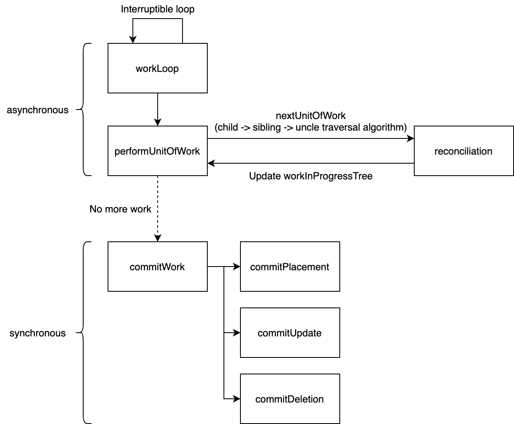

# my-own-react

Rewrite React Fiber core algorithm in 300 lines with links to the React source code.

- The data structure and algorithm of Fiber
- An interruptible unit of work (_conceptually_ same as concurrent mode)
- Render and commit phase

Architecture;

Resources;

- https://reactjs.org/docs/codebase-overview.html#fiber-reconciler
- https://github.com/facebook/react/issues/7942
- https://github.com/pomber/didact
